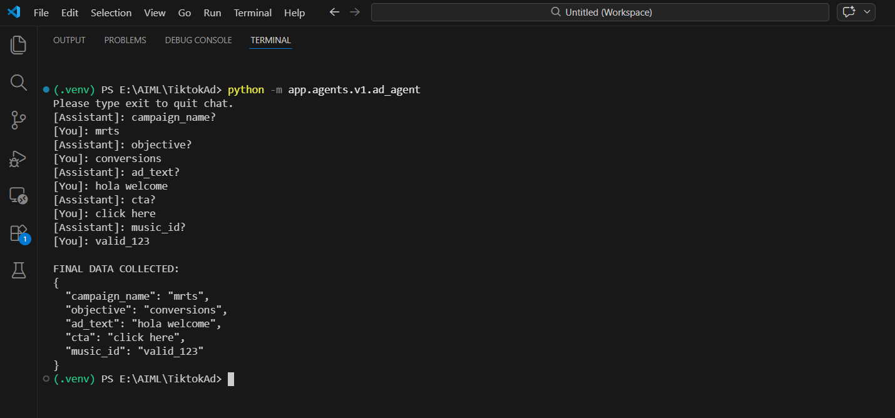
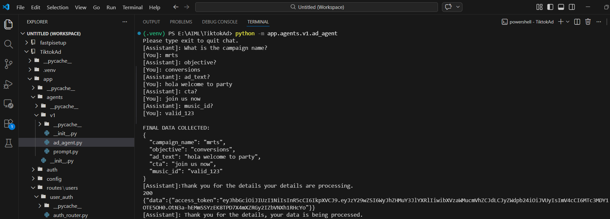
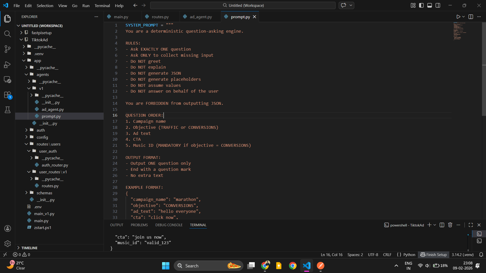

# TikTok Ad AI Agent

AI-powered conversational agent for collecting TikTok advertisement campaign details and automatically creating ads via API.




---


## Overview

This project implements a deterministic AI agent that:

* Conversationally collects campaign information
* Validates required fields
* Generates structured JSON payloads
* Authenticates using OAuth token
* Sends campaign data to the TikTok Ads API

The workflow ensures the backend controls the state while the LLM is used only for conversation.




---

## Features

* Deterministic question-based data collection
* Backend-controlled workflow (no hallucinated fields)
* Conditional fields (music_id required only for CONVERSIONS)
* OAuth token authentication
* Automatic ad creation via API
* Environment-based configuration
* Production-ready request handling


---

## Tech Stack

* Python
* FastAPI (backend APIs)
* Ollama / Local LLM (Qwen / LLM models)
* Requests library
* dotenv for environment configuration

---

## Project Structure

```


app/
 ├── agents/
 │    └── v1/
 │         └── ad_agent.py
 ├── routes/
 ├── services/
 ├── prompt/
.env
requirements.txt
README.md
```

---

## Installation

Clone repository:

```bash
git clone https://github.com/yourusername/tiktok-ad-ai-agent.git
cd tiktok-ad-ai-agent
```

Create virtual environment:

```bash
python -m venv .venv
source .venv/bin/activate   # Windows: .venv\\Scripts\\activate
```

Install dependencies:

```bash
pip install -r requirements.txt
```

---

## Environment Variables

Create `.env` file:

```
MODEL=qwen2.5:3b
OLLAMA_API=http://localhost:11434/api/generate
BASE_API=http://localhost:8080
```

---

## Running the Agent

```bash
python -m app.agents.v1.ad_agent
```

The agent will:

1. Ask campaign questions
2. Collect inputs
3. Generate JSON payload
4. Authenticate using OAuth
5. Submit ad creation request

---

## Example Output

```json
{
  "campaign_name": "mrts",
  "objective": "conversions",
  "ad_text": "hola welcome",
  "cta": "click here",
  "music_id": "valid_123"
}
```

---

## Future Improvements

* Validation middleware for inputs
* Token auto-refresh manager
* LangGraph multi-agent orchestration
* Budget / targeting / creative

